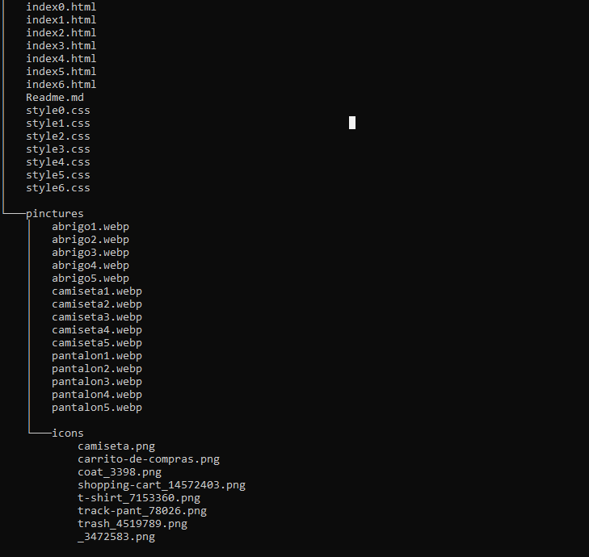
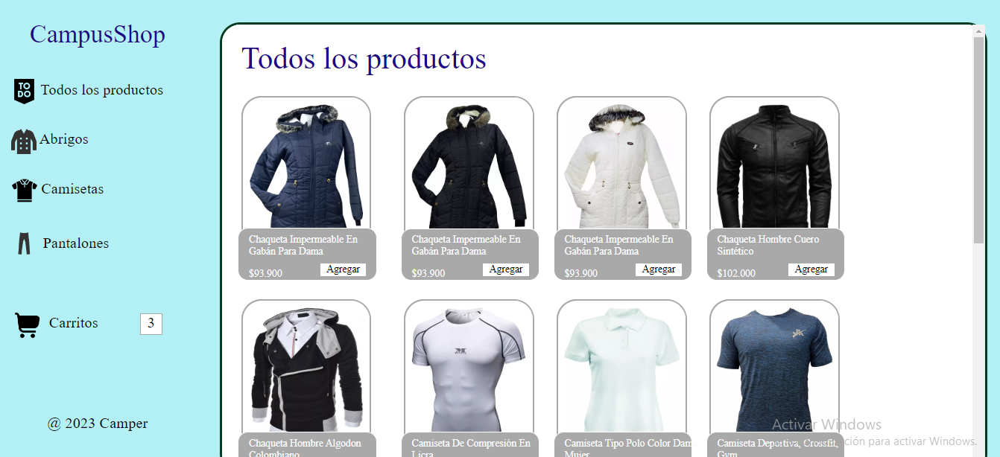

# CampusShop
 
 Aplicativo web implementado para  la venta de ropa only buscando la interación con diferentes personas del mundo para una mejor comodidad y facilidad de compra.

## Tabla De Contenido
| Índice | Título |Descripción|
|--|------|----|
| 1 | index0 | Todo los productos|
| 2 | index1 |Abrigos|
| 3 | index2 |Camisetas|
| 4 | index3 |Pantalones|
| 5 | index4 |Carrito|
| 6 | index5 |Carrito vacio|

## Instalación
 Deberas ejecutar el siguiente comando para clonar el repositorio y verlo desde tu maquina local:
 
 Gith Bash

~~~ 
git clone  "link del repositorio" https://github.com/YurleyBG/Filtro_YurleyBotello.git
~~~
al hacer esto se descargará  los datos del repositorio. puedes usar visual studio code  y descargar la extensión live server para abrir los archivos index.

 ## Tecnología utilizadas

 * HTML5
 * CSS3

 ## Estructura de Proyecto

 ## Características de Diseño

 1. Uso de medidas vw para responsive.
 2. Uso de icons y imagenes para diseños.
 3. Color claros para estetica de la páginas.
 4. Barra lateral de navegación.

 ## Cómo se usa

Cada sección permite un cambio de página automático al presionar cualquiera de las ahí mostradas.

### Secciones 
+ Todos los productos.
+ Abrigos.
+ Camisetas.
+ Pantalones.
+ Carrito.

 ## Crédito 
   Este proyecto filtro fue desarrollado por Yurley Botello.
